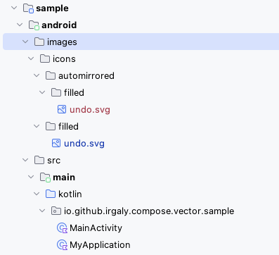
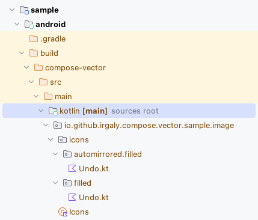

# Gradle Compose Vector Plugin

Gradle Plugin for Converting SVG file to [Compose ImageVector](https://developer.android.com/reference/kotlin/androidx/compose/ui/graphics/vector/ImageVector).

This plugin supports:

* Kotlin Multiplatform Project (KMP).
* Android Project.
* Gradle Incremental Build for converting SVG to ImageVector.

## Usage

Apply this plugin to your KMP project or Android Project.

`app/build.gradle.kts`

```kotlin
plugins {
  // For example, Android Application Project
  id("org.jetbrains.kotlin.android")
  id("com.android.application")
  // or Android Library Project
  //id("com.android.library")
  // or KMP Project
  //id("org.jetbrains.kotlin.multiplatform")

  // Apply Compose Vector Plugin
  id("io.github.irgaly.compose-vector") version "0.2.0"
}
...
```

Configure plugin with `composeVector` extension.

`app/build.gradle.kts`

```kotlin
composeVector {
  // This is a required configuration.
  // The destination package that ImageVector Images will place to.
  packageName = "io.github.irgaly.compose.vector.sample.image"

  // This is an optional configuration.
  // The directory that SVG files are placed.
  // Default value is "{project directory}/images"
  inputDir = layout.projectDirectory.dir("images")
}
```

Then put your SVG files to `inputDir`.

`{project directory}/images` directory is default location.



Run `generateImageVector` task for generating ImageVector classes.

Or `KotlinCompile Task` will trigger generateImageVector task by tasks dependency.

```shell
# run generateImageVector
% ./gradlew :app:generateImageVector

# or compile task
% ./gradlew :app:compileDebugKotlin
...
> Task :app:generateImageVector UP-TO-DATE
...
> Task :app:compileDebugKotlin
...
```

The ImageVector classes will be placed to under `build/compose-vector` directory by default.



The outputDir under `build` directory is registered to SourceSet by default,
so generated ImageVector classes can be used from your project.

```kotlin
...
import io.github.irgaly.compose.vector.sample.image.Icons
import io.github.irgaly.compose.vector.sample.image.icons.automirrored.filled.Undo
import io.github.irgaly.compose.vector.sample.image.icons.filled.Undo
...
    MaterialTheme {
        Column(Modifier.fillMaxSize()) {
            Image(Icons.Filled.Undo, contentDescription = null)
            Image(Icons.AutoMirrored.Filled.Undo, contentDescription = null)
        }
    }
```

The generated ImageVector property will be something like this:

```kotlin
...
@Suppress("RedundantVisibilityModifier")
public val Icons.Filled.Undo: ImageVector
    get() {
        if (_undo != null) {
            return _undo!!
        }
        _undo = Builder("Undo", 24.dp, 24.dp, 960f, 960f).apply {
            group(translationY = 960f) {
                val fill0 = SolidColor(Color(0xFFE8EAED))
                val fillAlpha0 = 1f
                val strokeAlpha0 = 1f
                val strokeLineWidth0 = 1f
                val strokeLineCap0 = StrokeCap.Butt
                val strokeLineJoin0 = StrokeJoin.Miter
                val strokeLineMiter0 = 4f
                path(fill = fill0, fillAlpha = fillAlpha0, strokeAlpha = strokeAlpha0,
                        strokeLineWidth = strokeLineWidth0, strokeLineCap = strokeLineCap0,
                        strokeLineJoin = strokeLineJoin0, strokeLineMiter = strokeLineMiter0) {
                    moveTo(280f, -200f)
                    verticalLineToRelative(-80f)
                    horizontalLineToRelative(284f)
                    quadToRelative(63f, 0f, 109.5f, -40f)
                    reflectiveQuadTo(720f, -420f)
                    quadToRelative(0f, -60f, -46.5f, -100f)
                    reflectiveQuadTo(564f, -560f)
                    horizontalLineTo(312f)
                    lineToRelative(104f, 104f)
                    lineToRelative(-56f, 56f)
                    lineToRelative(-200f, -200f)
                    lineToRelative(200f, -200f)
                    lineToRelative(56f, 56f)
                    lineToRelative(-104f, 104f)
                    horizontalLineToRelative(252f)
                    quadToRelative(97f, 0f, 166.5f, 63f)
                    reflectiveQuadTo(800f, -420f)
                    quadToRelative(0f, 94f, -69.5f, 157f)
                    reflectiveQuadTo(564f, -200f)
                    horizontalLineTo(280f)
                    close()
                }
            }
        }.build()
        return _undo!!
    }

private var _undo: ImageVector? = null

@Preview
@Composable
private fun UndoPreview() {
    Image(Icons.Filled.Undo, null)
}

@Preview(showBackground = true)
@Composable
private fun UndoBackgroundPreview() {
    Image(Icons.Filled.Undo, null)
}
```

## ImageVector properties structure

The input directories structure will be mapped to ImageVector properties structure.

For example:

```
images
└── icons
    ├── automirrored
    │   └── filled
    │       └── undo.svg
    └── filled
        └── undo.svg
```

This produces two ImageVector properties:

* `Icons.AutoMirrored.Filled.Undo: ImageVector`
* `Icons.Filled.Undo: ImageVector`

The first directory's name `icons` will be root Object Class name `Icons`.
The other directories will be used as package names.
SVG file names will be used as ImageVector property names.

## Name Conversion

The package name is same as input directory names.

The receiver classes and the ImageVector property names will converted by drop Ascii Symbols, then converted from snake cases to camel cases.
In special case, the `automirrored` package name will be `AutoMirrored` receiver class.

Name conversion example:

* undo.svg -> `Undo` property
* vector_image.svg -> `VectorImage` property
* 0_image.svg -> `Image` property
* _my_icon.svg -> `MyIcon` property
* my_icon_.svg -> `MyIcon` property
* my_icon_0.svg -> `MyIcon0` property
* 0_my_icon.svg -> `_0MyIcon` property
* MyIcon.svg -> `MyIcon` property
* MySVGIcon.svg -> `MySVGIcon` property

If you want to apply custom name conversion rule, please use `composeVector` extension's transformer options.

## Support AutoMirrored ImageVector

The `automirrored` package name is a special name.

The ImageVector classes under `automirrored` package or sub packages will be exported with [autoMirror = true](https://developer.android.com/reference/kotlin/androidx/compose/ui/graphics/vector/ImageVector#autoMirror()).

```kotlin
public val Icons.AutoMirrored.Filled.Undo: ImageVector
    get() {
        if (_undo != null) {
            return _undo!!
        }
        _undo = Builder("Undo", 24.dp, 24.dp, 960f, 960f, autoMirror = true).apply {
            ...
```

## Project type and SourceSets

If the output directory is under the project's `build` directory, The output directory will be registered to SourceSets.

| Project type          | composeVector configuration                      | registered SourceSets   |
|-----------------------|--------------------------------------------------|-------------------------|
| KMP project           | multiplatformGenerationTarget = Common (Default) | Common Main SourceSets  |
| KMP + Android project | multiplatformGenerationTarget = Android          | Android Main SourceSets |
| Android project       | -                                                | Android Main SourceSets |

## composeVector Extension options

`build.gradle.kts`

```kotlin
composeVector {
    // ImageVector classes destination package name
    // 
    // Required
    packagenName = "your.package.name"

    // Vector files directory
    //
    // Optional
    // Default: {project directory}/images
    inputDir = layout.projectDirectory.dir("images")
    
    // Generated Kotlin Sources directory.
    // outputDir is registered to SourceSet when outputDir is inside of project's buildDirectory.
    //
    // Optional
    // Default: {build directory}/compose-vector/src/main/kotlin
    outputDir = layout.buildDirectory.dir("compose-vector/src/main/kotlin")
    
    // Custom preconverter logic to ImageVector property names and receiver class names.
    //
    // * args
    //   * File: source file or directory's File instance
    //   * String: source file or directory's name
    //
    // Optional
    preClassNameTransformer.set (org.gradle.api.Transformer { (file: File, name: String) ->
        // custom logic here
        "pre_transformed_class_name"
    })

    // Custom postconverter logic to ImageVector property names and receiver class names.
    //
    // * args
    //   * File: source file or directory's File instance
    //   * String: transformed name
    //
    // Optional
    postClassNameTransformer.set (org.gradle.api.Transformer { (file: File, name: String) ->
        // custom logic here
        "transformed_class_name"
    })

    // Custom converter logic to package names.
    //
    // * args
    //   * File: source directory's File instance
    //   * String: source directory's name
    //
    // Optional
    packageNameTransformer.set (org.gradle.api.Transformer { (file: File, name: String) ->
        // custom logic here
        "transformed_package_name"
    })
    
    // Target SourceSets that generated images belongs to for KMP project.
    // This option is affect to KMP Project, not to Android only Project.
    //
    // Optional
    // Default: ComposeVectorExtension.GenerationTarget.Common
    multiplatformGenerationTarget = ComposeVectorExtension.GenerationTarget.Common
    //multiplatformGenerationTarget = ComposeVectorExtension.GenerationTarget.Android

    // Generate androidx.compose.ui.tooling.preview.Preview functions for Android target or not
    //
    // Optional
    // Default: true
    generateAndroidPreview = true

    // Generate org.jetbrains.compose.ui.tooling.preview.Preview functions for KMP common target or not
    //
    // Optional
    // Default: false
    generateJetbrainsPreview = false

    // Generate androidx.compose.desktop.ui.tooling.preview.Preview functions for KMP common target or not
    //
    // Optional
    // Default: true
    generateDesktopPreview = true
}
```

## Debug with logging

This plugin will be logging with `--info` gradle option.

```shell
% ./gradlew :app:generateImageVector --info
...
> Task :app:generateImageVector
Build cache key for task ':app:generateImageVector' is dc07551486b4a33c25fa9d1ef7b64905
Task ':app:generateImageVector' is not up-to-date because:
  Task.upToDateWhen is false.
The input changes require a full rebuild for incremental task ':app:generateImageVector'.
clean .../app/build/compose-vector/src/main/kotlin because of initial build or full rebuild for incremental task and there in under project build directory.
changed: Input file .../app/images/icons/automirrored/filled/undo.svg added for rebuild.
convert icons/automirrored/filled/undo.svg to icons/automirrored/filled/Undo.kt
changed: Input file .../app/images/icons/filled/undo.svg added for rebuild.
convert icons/filled/undo.svg to icons/filled/Undo.kt
write object file: Icons.kt
Stored cache entry for task ':app:generateImageVector' with cache key dc07551486b4a33c25fa9d1ef7b64905
...
```

## Use SVG to ImageVector converter as Java Library

SVG to ImageVector converter logic is packaged as Java library, so it can be used from your java CLI or applications.

`build.gradle.kts`

```kotlin
plugins {
    id("org.jetbrains.kotlin.jvm")
}
...
dependencies {
    implementation("io.github.irgaly.compose.vector:compose-vector:0.2.0")
}
```

Then use `SvgParser` class and `ImageVectorGenerator` class.

```kotlin
val inputStream = ... // SVG content as InputStream from File or String etc...
val imageVector: io.github.irgaly.compose.vector.node.ImageVector = SvgParser(object : Logger {
    override fun debug(message: String) {
        println("debug: $message")
    }

    override fun info(message: String) {
        println("info: $message")
    }

    override fun warn(message: String, error: Exception?) {
        println("warn: $message | $error")
    }

    override fun error(message: String, error: Exception?) {
        println("error: $message | $error")
    }
}).parse(
    inputStream,
    name = "Icon"
)
val kotlinSource: String = ImageVectorGenerator().generate(
    imageVector = imageVector,
    destinationPackage = "io.github.irgaly.icons",
    receiverClasses = listOf("Icons", "AutoMirrored", "Filled"),
    extensionPackage = "io.github.irgaly.icons.automirrored.filled",
    hasAndroidPreview = true,
)
println(kotlinSource)
```

## Supported SVG specifications

This plugin's converter is using [Apache Batik](https://xmlgraphics.apache.org/batik/) SVG parser,
and supports basics specifications of SVG 1.2 + CSS style tag.

Here is a supporting table.

| SVG tag        | SVG attribute                                                                            | Supporting Status                                                 |
|----------------|------------------------------------------------------------------------------------------|-------------------------------------------------------------------|
| (any)          | id, class                                                                                | :white_check_mark:                                                |
| (any)          | style                                                                                    | :white_check_mark:                                                |
| (any)          | transform                                                                                | :white_check_mark:                                                |
| (any)          | display                                                                                  | :white_check_mark:                                                |
| (any)          | visibility                                                                               | :white_check_mark:                                                |
| (any)          | color                                                                                    | :white_check_mark:                                                |
| (any)          | fill, fill-opacity, fill-rule                                                            | :white_check_mark:                                                |
| (any)          | stroke, stroke-opacity, stroke-width, stroke-linecap, stroke-linejoin, stroke-miterlimit | :white_check_mark:                                                |
| (any)          | clip-path, clip-rule, clipPathUnits                                                      | :white_check_mark:                                                |
| svg            | viewBox, width, height                                                                   | :white_check_mark:<br/>Nested SVG tag is supported.               |
| symbol         | viewBox, x, y, width, height                                                             | :white_check_mark:                                                |
| g              |                                                                                          | :white_check_mark:                                                |
| path           | d                                                                                        | :white_check_mark:                                                |
| rect           | x, y, width, height, rx, ry                                                              | :white_check_mark:                                                |
| circle         | cx, cy, r                                                                                | :white_check_mark:                                                |
| ellipse        | cx, cy, rx, ry                                                                           | :white_check_mark:                                                |
| line           | x1, x2, y1, y2                                                                           | :white_check_mark:                                                |
| polyline       | points                                                                                   | :white_check_mark:                                                |
| polygon        | points                                                                                   | :white_check_mark:                                                |
| clipPath       |                                                                                          | :white_check_mark:                                                |
| defs           |                                                                                          | :white_check_mark:                                                |
| linearGradient | gradientUnits, spreadMethod, x1, x2, y1, y2                                              | :white_check_mark:                                                |
| radialGradient | gradientUnits, cx, cy, fr                                                                | :white_check_mark:                                                |
| stop           | offset, stop-color                                                                       | :white_check_mark:                                                |
| use            | href, xlink:href                                                                         | :white_check_mark:                                                |
| a              |                                                                                          | a tag is treated as same as g tag. No clickable feature.          |
| title          |                                                                                          | This tag is just ignored                                          |
| desc           |                                                                                          | This tag is just ignored                                          |
| metadata       |                                                                                          | This tag is just ignored                                          |
| view           |                                                                                          | This tag is just ignored                                          |
| script         |                                                                                          | This tag is just ignored                                          |
| cursor         |                                                                                          | This tag is just ignored                                          |
| animate        |                                                                                          | Not supported because ImageVector doesn't have animation feature. |
| text           |                                                                                          | Not supported because ImageVector can't draw texts.               |
| image          |                                                                                          | Not supported because ImageVector can't draw images.              |
| filter         |                                                                                          | Not supported.                                                    |
| mask           |                                                                                          | Not supported.                                                    |
| switch         |                                                                                          | Not supported.                                                    |
| foreignObject  |                                                                                          | Not supported.                                                    |

### Color format style

CSS4 Named Colors and sRGB colors are supported for color format.

| Color Format Style                                                          | Supporting Status  |
|-----------------------------------------------------------------------------|--------------------|
| [CSS4 Named Colors](https://www.w3.org/TR/css-color-4/#named-colors)        | :white_check_mark: |
| rgb(0 0 0), rgb(0% 0% 0%), rgb(0, 0, 0)                                     | :white_check_mark: |
| rgb(0 0 0 0), rgb(0 0 0 / 0), rgb(0% 0% 0% 0%), rgb(0, 0, 0, 0)             | :white_check_mark: |
| rgba(0 0 0 0), rgba(0 0 0 / 0), rgba(0%, 0%, 0%, 0%)                        | :white_check_mark: |
| #RRGGBB, #RGB                                                               | :white_check_mark: |
| #RRGGBBAA, #RGBA                                                            | :white_check_mark: |


